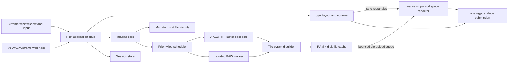

# Frank — product and technical design

Status: Draft for review  
Date: 2026-07-11  
Scope: Greenfield desktop application for Windows, macOS, and Linux

## 1. Executive decision

Build Frank as a fully native Rust application using `wgpu` for the tiled image renderer and `egui` for the deliberately small application UI. Phase 0 uses `eframe` as a thin, WGPU-only desktop host over `winit`; the image renderer, viewport model, and native services remain project-owned crates so the host can be replaced with direct `winit` if profiling finds a meaningful constraint.

Use one native `wgpu` surface, device, queue, and frame submission for both image rendering and UI. Rust owns the whole path: file access, metadata, decoding, color conversion, pyramid generation, cache policy, pane compositing, and controls. The renderer draws tiled image panes first and egui title strips/controls over them afterward. Large pixel buffers never cross a language boundary or IPC channel and processed GPU textures never need to be read back merely for display.

This keeps the most valuable RapidRAW lesson—Rust plus GPU processing—while removing its Tauri/webview integration layer. `wgpu` has first-class Vulkan support on Linux as well as DX12 on Windows and Metal on macOS. RapidRAW disabling its direct `WgpuDisplay` surface on Linux is a limitation of that application's current window/webview composition path, not a limitation of `wgpu` itself.

The recommended product boundary is:

- Release 1: a very fast, deterministic viewer and comparison workspace.
- Release 1.1: polish and comparison conveniences that do not alter source pixels.
- Release 2: automatic registration and non-destructive per-image adjustments.
- Release 3: an optional browser edition built from the portable UI, scene, and renderer crates; desktop remains the reference for performance and full format support.

### Stack alternatives considered

| Option | Strengths | Main concern | Decision |
|---|---|---|---|
| `eframe` (WGPU-only) + project-owned `wgpu` callbacks + `egui` | One native Rust/GPU stack, tested window lifecycle, shared device/surface access, no IPC or webview | UI is not native-looking; custom-paint lifecycle and overhead must be measured | **Phase-0 choice** |
| Direct `winit` + `wgpu` + `egui-winit`/`egui-wgpu` | Maximum lifecycle control with the same renderer and UI | More platform/event-loop code owned by the project | Fallback if the thin eframe host constrains performance |
| `winit` + `wgpu` + Iced | Native Rust, built-in `wgpu` renderer, richer retained application model | More framework ownership and a less direct custom-render integration; project describes itself as experimental | Secondary prototype if egui workflow is unsatisfactory |
| Slint + `wgpu` | Polished declarative UI and native Rust integration | Custom shared-`wgpu` rendering uses unstable integration APIs and adds a second UI language | Reconsider if UI complexity grows substantially |
| Tauri + React + native `wgpu` surface | Rich web UI plus native GPU rendering | Webview/native-surface composition and Linux Wayland/WebKitGTK behavior | Not recommended for the current simple UI |
| Qt 6/C++ or Qt/Rust bridge | Mature desktop widgets, color management, and native behavior | Large toolchain/package, bridge complexity, less aligned with the reference stack | Reconsider only for color-critical/enterprise requirements |

## 2. Product intent

Frank should make it effortless to answer: “What differs between these images at the same place and scale?”

Primary qualities, in order:

1. Navigation remains fluid even when the source files are much larger than the display.
2. At 100%, one source pixel maps predictably to one physical framebuffer pixel; preview substitution or smoothing is never ambiguous.
3. Synchronized views are predictable and easy to escape temporarily.
4. Every image remains identifiable without consuming much screen space.
5. The application is local-first and never modifies source images.
6. The same project and interactions behave consistently on Windows, macOS, and Linux.

### Working assumptions

These assumptions let development begin before all product questions are settled:

- Performance acceptance workload is four simultaneous images at 100 megapixels each; eight panes are the functional rather than peak-performance upper bound for release 1.
- Files may include occasional TIFFs in the 1–4 GB range.
- Release 1 targets accurate screen comparison, not prepress soft-proofing or scientific pixel measurement.
- RAW files are shown using a neutral, documented default development, with the embedded preview shown immediately where possible.
- User notes and layout state are stored in an application session/sidecar; originals remain read-only.
- An integrated GPU is sufficient. Dedicated GPUs improve high-DPI/many-pane performance but are not required.
- Release 3 may run in a browser. Releases 1–2 must therefore avoid unnecessary OS coupling in the UI/scene model, without accepting browser constraints in the native hot path.
- Local builds and quality gates run in pinned Docker environments so Rust, LLVM, Wine, and SDK support files do not need host installation. Linux is built natively in the container; Windows MSVC-ABI artifacts are cross-built with `cargo-xwin`; native CI runners remain the platform validation authority.

### Confirmed product decisions

- Primary users: photographers and pixel peepers.
- Overlay/wipe comparison is included in release 1.
- Launch RAW corpus: OM Digital Solutions OM-5 `.ORF`, including high-resolution mode; Canon EOS R6 `.CR3`, including RAW and C-RAW.
- License: GNU Affero General Public License v3 or later (`AGPL-3.0-or-later`). Distributed derivatives must remain under the same license with corresponding source available; modified network versions must also offer source to their users.
- Performance acceptance case: four 100 MP images on the current development system.

### License policy

The project uses `AGPL-3.0-or-later`. Its strong copyleft prevents distributed closed-source derivatives, and modified network services must offer corresponding source to their users. Commercial use and sale remain allowed when all AGPL obligations are met; an extra no-sale condition would make the project non-open-source and is therefore not added.

A later trademark policy may reserve the official Frank name and branding so third parties cannot present forks as official releases. Contributions are accepted under the same project license unless a separate contributor agreement is adopted later.

## 3. Scope by release

### Release 1 — comparison core

Required:

- Windows, macOS, and Linux desktop packages.
- Open files, folders, OS “Open with”, and drag/drop.
- JPEG/JPG, TIFF/BigTIFF, and a documented set of current camera RAW formats.
- Two or more simultaneous image panes.
- Row, column, and automatic grid layouts.
- Drag a pane by its title/grab area to reorder it; show a clear drop target.
- Pan and zoom all panes synchronously or operate any pane independently.
- Fit, fill, 100%/1:1, and reset commands.
- Define 100%/1:1 as one oriented source image pixel per physical swapchain/framebuffer pixel, independent of OS UI scaling. Show the current ratio explicitly on HiDPI screens.
- Four synchronization interpretations inspired by Butterfly Viewer: fit-relative, width-relative, height-relative, and source-pixel/1:1.
- Compact title strip always visible for each pane.
- Configurable title fields: filename, dimensions, file size, camera, lens, focal length, aperture, shutter, ISO, capture time, and user note.
- Editable user note per image.
- Toggle interpolation between smooth and nearest-neighbor at high zoom.
- Distinguish embedded RAW preview, reduced-resolution decode, and full developed RAW with an unobtrusive quality/status indicator; never present an embedded preview as a 1:1 source view.
- Fullscreen/focus mode.
- Recoverable decode errors and cancellation of obsolete work.
- Automatic session recovery after a crash or normal restart.

Recommended because it is cheap once the tiled renderer exists:

- Copy current comparison view to clipboard and export a screenshot.
- Keyboard shortcut reference and command palette.
- Optional pixel grid and source-coordinate/display-RGB readout at high zoom.

Required comparison mode:

- An overlay/wipe view for 2–4 already aligned images, including opacity per layer and a movable 1D or 2D split.

Explicitly out of scope for release 1:

- Editing or exporting modified source images.
- Automatic image alignment/registration.
- Per-image brightness/color adjustment.
- DAM/library/catalog features, ratings, tags, or file management.
- Cloud storage, accounts, telemetry, or network services.
- Pixel measurement, difference heatmaps, or formal color-proofing.

### Release 1.1 — comparison polish

- Tabs or named workspaces.
- Save/open portable `.ictsession` files with relative-path repair.
- Blink A/B mode.
- Optional difference and blend modes for already aligned images.
- Navigator/minimap for extreme zoom.
- Recent sessions and pinned comparison presets.
- Better touch/trackpad gestures and accessibility review.

### Release 2 — registration and visual normalization

- Automatic feature extraction and pairwise matching against a selected reference image.
- Translation, similarity, affine, and homography transform models, with confidence and visible inlier diagnostics.
- Manual control points and transform correction when automatic matching is weak.
- “Match current location” and “match all to reference” commands.
- Non-destructive per-image adjustments: exposure/brightness, contrast, gamma, temperature/tint, saturation, black/white points, and reset/copy/paste.
- GPU adjustment shaders applied consistently in pane, overlay, screenshot, and registration preview paths.
- Optional perceptual difference visualization after registration.

Do not commit to OpenCV in the main package yet. During release 2, spike a pure-Rust path and an OpenCV helper path using the same `RegistrationEngine` interface. ORB/AKAZE + descriptor matching + RANSAC is a sensible baseline; transformation choice should be explicit rather than always applying a full homography.

### Release 3 — browser edition

Goal: open a web page, select or drop local images, and use the familiar comparison UI without installing the desktop application.

Proposed initial browser scope:

- The same egui UI state, viewport math, synchronization behavior, WGSL shaders, pane compositor, and session schema as desktop.
- WebAssembly host using eframe `WebRunner` or a thin direct web host selected after a release-3 spike.
- WebGPU renderer with WebGL fallback only when required texture formats and limits are available.
- User-selected JPEG, PNG, and a tested TIFF subset first.
- Local-only processing by default; selecting a file must not upload it.
- Import/export session JSON through browser file selection/download.

Expected limitations unless later research removes them:

- No unrestricted filesystem paths, OS “Open with”, native helper process, or ordinary disk cache.
- Smaller memory budget and less predictable GPU limits than desktop.
- RAW support is optional: `rawler`, threads, memory use, decode latency, and licensing/distribution must be validated under WASM before promising parity.
- Multi-gigabyte TIFF and long-lived disk pyramids may remain desktop-only. OPFS/IndexedDB caching is possible but quota-limited and browser-dependent.

Release 3 is not a reason to route the desktop application through a browser engine. It is a second host around portable crates.

## 4. Core user experience

### Main window

The default window is intentionally sparse:

```text
┌──────────────────────────────────────────────────────────────────┐
│ Open  Layout  Sync ▾  Fit  1:1  Overlay  Focus      4 images    │
├──────────────────────────────────────────────────────────────────┤
│ filename · 45 MP · ISO 400 · 1/250 · note… │ filename · …       │
│                                               │                  │
│                 image pane A                  │   image pane B   │
│                                               │                  │
├───────────────────────────────────────────────┼──────────────────┤
│ filename · …                                  │ filename · …     │
│                 image pane C                  │   image pane D   │
└──────────────────────────────────────────────────────────────────┘
```

- The top toolbar holds session-level commands.
- Every pane has a 40–44 px fixed two-line title strip above the image viewport.
- Long title values ellipsize; hovering or focusing shows the full structured title.
- Clicking the note segment edits it inline. Notes must be usable with keyboard only.
- Dragging the title/grab area reorders panes. Dragging the image pans it.
- An active-pane ring is subtle but unambiguous; keyboard commands apply to the active pane unless they are explicitly global.

### Pan and zoom behavior

Store viewport state in image coordinates, never window/widget coordinates:

```text
Viewport = {
  center: normalized image point [0..1, 0..1],
  zoom: source pixels per CSS pixel,
  fitZoom: derived for the current pane,
  rotation: display orientation,
  syncGroup: optional group id
}
```

Default synchronized mode is fit-relative: panes share normalized center and the ratio `zoom / fitZoom`. This makes images with different dimensions feel aligned without pretending their source pixels are equivalent.

Other modes:

- Width-relative: same normalized center and same displayed fraction of image width.
- Height-relative: same normalized center and same displayed fraction of image height.
- Pixel/1:1: one source pixel has the same displayed size in each pane.

Interaction rules:

- Wheel or pinch: zoom around the pointer, not the pane center.
- Primary drag on image: pan.
- Double-click: toggle fit ↔ 1:1 around the clicked point.
- Hold `Alt`/`Option`: temporarily operate the pointed pane independently.
- Toggle the pane link icon: remove/add the pane from the current sync group.
- `Shift+0`: fit all; `0`: fit active; `1`: active at 1:1.
- Synchronization events carry a monotonically increasing generation ID so panes never feed changes back into one another.

### Loading feedback

Each pane progresses independently:

1. Header and metadata appear.
2. A thumbnail or RAW embedded preview appears.
3. A display-size level replaces it.
4. Higher-resolution tiles refine only where visible.

Never block already loaded panes because one file is slow. A stale job must be cancelled when a pane is closed, replaced, or moved to a zoom level that makes the work irrelevant.

### Overlay mode

Overlay mode consumes existing pane transforms rather than creating another image model.

- The first image is the reference/base.
- Two-image mode offers vertical wipe, horizontal wipe, blink, and opacity blend.
- Up to four aligned images can use a cursor-following 2D quadrant split similar to Butterfly Viewer.
- The split can be locked; each layer has opacity and visibility.
- Release 1 clearly labels this “for aligned images.” Release 2 can populate alignment transforms automatically.

## 5. Architecture



### Native shell and UI

- In Phase 0, `eframe` owns the top-level `winit` window, event loop, DPI changes, drag/drop, input, and redraw scheduling while being forced to its WGPU renderer.
- Eframe exposes the WGPU render state and custom paint callbacks; project-owned image rendering and `egui` controls share the same device, queue, and swapchain texture.
- Compute egui layout first to produce a `WorkspaceLayoutSnapshot` of pane title and image rectangles. Render image panes with scissor rectangles, then paint egui on top in the same frame.
- Keep UI state in ordinary Rust structs. High-frequency pan/zoom state lives beside the renderer and does not traverse a message framework.
- Use egui for toolbar buttons, menus, title strips, inline note editing, settings, dialogs, tooltips, and accessibility through AccessKit.
- Use `rfd` or a small platform abstraction for native open/save dialogs; validate its Linux portal behavior in Phase 0.
- Request continuous redraw only during gestures/animation. When idle, redraw on window events, completed tile jobs, or state changes.
- Keep the option to replace egui behind a small `UiShell` boundary, but do not abstract individual widgets prematurely.

### Rust core

Suggested crates are provisional until the architecture spike:

- `eframe` with only its WGPU backend, plus `wgpu` and `egui`, for the Phase-0 native shell, renderer, and controls. Direct `winit`/`egui-winit` remains a host-level fallback.
- `rayon` for bounded CPU decode/resize work and `crossbeam-channel` or `flume` for priority results/cancellation; add `tokio` only if later asynchronous I/O justifies a runtime.
- `turbojpeg`/libjpeg-turbo for fast scaled JPEG decode.
- `tiff` for TIFF/BigTIFF metadata, pages, strips, tiles, and incremental coding-unit reads; add fallback coverage only after a test corpus exposes gaps.
- `rawler` for RAW metadata, embedded previews, and development.
- `kamadak-exif` plus format-specific RAW metadata for title fields.
- LittleCMS (`lcms2`) for embedded ICC → working/display sRGB conversion.
- `fast_image_resize` for pyramid levels.
- `moka` or a purpose-built weighted LRU for decoded tile memory.
- `serde`/`serde_json` for sessions and settings; do not use JSON for pixels.

The core exposes capability-oriented Rust methods rather than decoder details:

```text
probe_file(path) -> ImageDescriptor
open_image(path, options) -> ImageId
request_tiles(image_id, viewport, quality_generation)
cancel_generation(image_id, generation)
update_note(image_id, note)
save_session(path?)
```

Workers return `TileReady { key, generation, pixels }` through a bounded in-process upload queue. The render thread validates the generation, uploads with `Queue::write_texture` or a reusable staging path, and discards the CPU buffer after cache policy is applied. There is no serialization, IPC, base64, or duplicate frontend texture cache.

### Renderer abstraction

Define a narrow renderer contract from day one:

```text
Renderer.initialize(surface)
Renderer.setLayout(paneRects)
Renderer.setScene(imageDescriptors, viewportTransforms, overlayState)
Renderer.uploadTile(tileKey, pixels)
Renderer.evictTile(tileKey)
Renderer.render(frameTime)
Renderer.capture()
```

Release 1 implements this directly with native `wgpu`. Keep shaders within the common Vulkan/DX12/Metal feature subset and avoid optional adapter features unless a measured fast path has a fallback.

### Single-surface rationale

- One GPU context and one frame scheduler.
- Easy scissoring for many panes and overlay modes.
- Image rendering and UI share the same `wgpu::Device`, queue, swapchain texture, and command submission.
- Pane reorder changes rectangles and draw order, not decoder ownership.
- No webview compositor, cross-language state synchronization, or GPU-to-CPU readback for display.
- Egui text and widgets remain accessible through its AccessKit integration.

The main cost is coordinating egui layout with the custom render pass. Keep that contract in one `WorkspaceLayoutSnapshot` generated once at the start of each required frame.

### Release-3 portability seam

Keep four boundaries explicit from the beginning:

- `viewer-model`: platform-independent sessions, panes, titles, viewports, synchronization, overlay state, and commands.
- `ui-egui`: egui widgets/layout expressed without direct filesystem, process, or native-window calls.
- `renderer-wgpu`: scene and tile rendering using the native/WebGPU subset of `wgpu` and WGSL.
- `platform`: file selection, file sources, worker execution, persistence, clipboard, and cache storage.

Desktop supplies native paths, threads/processes, memory mapping, and disk cache. Release 3 supplies browser `File` objects, cooperative jobs or Web Workers, downloads, and optional OPFS/IndexedDB. Decoder traits operate on bounded byte/range sources rather than assuming every image is a native `PathBuf`.

Do not force all native decoders to compile to WASM. The browser may use pure-Rust decoder implementations behind the same descriptor/tile interfaces while desktop keeps SIMD/native fast paths.

## 6. Large-image and cache design

### Pyramid

Every opened image has a logical power-of-two pyramid. Choose the closest level that provides roughly 1–1.5 source samples per display pixel, then request only tiles intersecting the pane plus a one-tile prefetch ring.

- Nominal tile size: 512 × 512.
- Add a one-pixel replicated border to avoid sampling seams.
- Use lower-resolution fallback tiles while a preferred tile is loading.
- Prioritize: visible center → visible edges → pan direction → prefetch ring.
- Stop requesting detail while the user is rapidly zooming; resume after a short settle threshold.

### Format-specific paths

JPEG:

- Decode an 1/8 or 1/4 DCT-scaled preview first.
- Build the base/pyramid once in the background if deeper zoom is requested.
- Release full decoded buffers as soon as tiles are committed.

TIFF/BigTIFF:

- Parse dimensions, page count, sample type, ICC profile, and orientation before decoding pixels.
- Decode native tiles or strips incrementally when supported.
- Use embedded reduced-resolution IFDs as pyramid levels when compatible.
- Support first-page display in release 1; expose page selection if the target users require multipage TIFF.
- Put strict allocation and decompression limits around malformed metadata.

RAW:

- Extract and show the largest embedded JPEG preview immediately.
- Read EXIF/camera fields independently of full development.
- Develop full RAW only when display size or zoom requires it.
- Generate a lossless pyramid, then free the full developed buffer.
- Run RAW development in an isolated helper process. `rawler` documents that malformed/unsupported input may panic; the UI should lose one decode job, not the application.
- Record the RAW development recipe/version in the cache key.

### Cache layers

1. GPU tile cache: only tiles needed by visible panes and immediate prefetch.
2. CPU tile cache: display-ready tiles weighted by actual byte size.
3. Disk pyramid cache: lossless, disposable, and versioned.

Suggested default budgets:

- GPU: min(512 MiB, a conservative adapter-derived limit), adjustable.
- CPU tiles: min(1.5 GiB, 15% of physical RAM), adjustable.
- Disk: 10 GiB default with LRU cleanup, adjustable/clearable.

Cache identity includes canonical file identity, size, modification timestamp, a sampled/full content hash as needed, decoder version, orientation, color conversion settings, and RAW recipe. Never key only by path.

Use a simple directory-backed tile store first. A 45 MP image yields only a few hundred 512 px tiles across all levels. Move to a packed store only if profiling shows filesystem metadata overhead is significant.

### Backpressure and cancellation

The job scheduler has bounded queues:

- Interactive visible-tile queue: highest priority.
- Preview/metadata queue: high priority.
- Prefetch queue: low priority and freely discardable.
- Pyramid/cache maintenance: idle priority.

Each pane/image request has a generation token. Workers check cancellation between scanline/strip/tile stages. Results for an obsolete generation may populate reusable disk cache, but must not update UI state.

## 7. Color and pixel policy

Release 1 needs a stated policy even without editing controls.

- Honor EXIF orientation.
- Convert embedded ICC profiles to sRGB for display.
- Treat untagged JPEG/TIFF as sRGB by default, with a future override for specialist users.
- Preserve alpha for TIFF and overlay use.
- Preserve 16-bit/float source precision while building internal source tiles when practical, but upload display-ready 8-bit sRGB tiles in release 1.
- RAW uses a fixed neutral recipe with camera white balance by default. The exact tone curve and highlight behavior must be documented and included in the cache key.
- The selected `wgpu` swapchain output is sRGB. Wide-gamut/HDR output is a later, separately tested capability.

Open question: if scientific, archival, prepress, or medical users are primary, 16-bit GPU textures, monitor ICC conversion, and numeric pixel inspection may need to move into release 1.

## 8. Titles, notes, and sessions

### Title template

Represent the title as structured segments, not a preformatted string:

```json
{
  "fields": ["filename", "dimensions", "camera", "lens", "focalLength", "aperture", "shutter", "iso", "note"],
  "separator": " · ",
  "hideEmpty": true,
  "maxLines": 1
}
```

Ship concise presets:

- Minimal: filename, note.
- Camera: filename, camera, focal length, aperture, shutter, ISO, note.
- Technical: filename, dimensions, bit depth, color profile, file size, note.

The fixed title strip never grows due to content. Full metadata appears in a popover/inspector.

### Session format

`.ictsession` is a versioned JSON document containing only small state:

- Image references: absolute path plus relative path from session file, file identity, optional relocation hint.
- Pane order and layout.
- Viewports and synchronization groups/mode.
- Overlay state.
- Title template and user notes.
- Release-2 transforms and adjustments when introduced.

Autosave recovery state in the application data directory. Saving a named session is explicit. Never write XMP or EXIF into source files in releases 1–2 unless a later export feature is separately approved.

## 9. Performance acceptance criteria

Measure on one agreed baseline machine for each OS and on a slower integrated-GPU machine.

Interaction:

- Pan/zoom input-to-frame p95 under 33 ms; target 16.7 ms at 60 Hz.
- No decode, resize, metadata parse, filesystem scan, or blocking channel receive on the render/event-loop path.
- Pane reorder preview stays at 60 fps with four loaded panes.

Loading, using local SSD and warm application process:

- JPEG/RAW embedded preview visible p50 under 300 ms and p95 under 800 ms for the agreed corpus.
- First useful large-TIFF view p50 under 500 ms and p95 under 1.5 s when a suitable tile/overview exists.
- Reopening a cached image at the prior viewport p50 under 150 ms.
- Closing/replacing a pane stops new obsolete visible work within 100 ms.

Memory:

- Opening four 100 MP images at fit does not retain four full-resolution RGBA buffers.
- GPU memory stays within configured budget during continuous pan/zoom.
- A failed multi-gigabyte TIFF allocation is reported without terminating the process.

Performance claims should always name corpus, hardware, cold/warm cache, resolution, and percentile.

### Primary benchmark system

Captured 2026-07-11 from the current development computer:

| Component | Baseline |
|---|---|
| System | AZW SER9 |
| OS | Windows 11 Pro 64-bit, build 26200 |
| CPU | AMD Ryzen AI 9 HX 370, 12 cores / 24 logical processors |
| GPU | Integrated AMD Radeon 890M, driver 32.0.31021.5001; shared/UMA memory architecture |
| RAM visible to OS | 58,319,740 KiB (about 55.6 GiB; some physical memory may be hardware/UMA-reserved) |
| Display | 2560 × 1440 at 60 Hz, 96 DPI / 100% scaling |

Run acceptance benchmarks plugged in with a recorded Windows power profile, release build, fixed test corpus, and both cold and warm disk caches. This is the primary Windows baseline, not evidence of Linux/macOS performance.

## 10. Reliability and security

- Treat decoders as untrusted-input boundaries even for local files.
- Apply dimension, pixel-count, chunk-count, decompressed-byte, and recursion limits before allocation.
- Isolate RAW development; consider isolating all third-party/native decoders if fuzzing exposes instability.
- Keep file operations behind explicit application methods and operate only on user-selected/session-referenced paths.
- No network capability in the default application.
- Crash-safe session writes: write temp, flush, atomic replace.
- Structured logs omit full file paths by default in diagnostics exported for bug reports.
- Preserve application usability if GPU initialization fails: show a clear diagnostic and provide a conservative software/compatibility mode if feasible.

## 11. Testing strategy

### Test corpus

Maintain redistributable fixtures plus local/private camera samples:

- Baseline/progressive JPEG; embedded ICC and EXIF orientations.
- TIFF: strips, tiles, BigTIFF, multipage, 8/16/32-bit, grayscale/RGB/RGBA, common compressions, malformed headers, huge declared dimensions.
- RAW: at least Canon CR2/CR3, Nikon NEF, Sony ARW, Fujifilm RAF/X-Trans, Panasonic RW2, Olympus/OM ORF, and DNG, including recent cameras selected by target users.
- Launch-gate RAW fixtures: multiple user-supplied OM-5 ORF files in normal and high-resolution modes, and Canon EOS R6 CR3 files in RAW and C-RAW modes, covering representative ISO values and orientations.
- Images with different dimensions/aspect ratios for every sync mode.
- Registered and deliberately unregistered overlay sets.

Camera support is decoder-and-model-specific, not extension-specific. Publish a generated compatibility report from the corpus.

### Automated layers

- Rust unit/property tests for coordinates, cache keys, limits, session migration, title formatting, and job cancellation.
- Golden pixel tests for orientation, ICC conversion, TIFF sample conversion, RAW recipe, and tile borders.
- Renderer golden screenshots on a deterministic software GPU where possible.
- AccessKit-driven `egui_kittest` interaction tests for stable control semantics and emitted UI actions.
- Live eframe/WGPU tests in an Xvfb and Mesa Lavapipe container, driven through egui inspection with screenshots, widget trees, and action logs retained as failure artifacts.
- State-machine and event-injection integration tests for pan, zoom anchor, temporary independent mode, reorder, notes, and recovery.
- Fuzz file probes and TIFF/metadata parsing; preserve every crashing file as a regression fixture when licensing permits.
- Cross-platform CI builds on Windows, macOS, and Linux; real-GPU smoke tests before release.

## 12. Packaging and platform support

Proposed minimums, subject to audience feedback:

- Windows 10 22H2+ x64; consider ARM64 after release 1.
- macOS 12+ on Apple Silicon and Intel if CI/hardware is available; otherwise Apple Silicon first with an explicit Intel decision.
- Ubuntu 22.04+/Fedora equivalent on X11 and Wayland; distribute AppImage and Flatpak first, then `.deb` if requested.

Plan code signing/notarization before public beta, not after feature completion:

- Windows Authenticode signing.
- Apple Developer ID signing and notarization.
- Linux Flatpak permissions restricted to user-selected files/folders where practical.

## 13. Repository shape

```text
Frank/
  apps/desktop/                 # native eframe/WGPU host (releases 1–2)
  apps/web/                     # planned WASM/eframe host (release 3)
  crates/
    viewer-model/               # portable app/session/viewport state
    ui-egui/                    # portable controls and layout
    renderer-wgpu/              # portable native/WebGPU scene renderer
    imaging-core/               # descriptors, coordinates, color policy
    decode-raster/              # decoder traits and portable implementations
    decode-raster-native/       # optional native SIMD/codec fast paths
    decode-raw-worker/          # isolated helper binary
    tile-cache/                 # pyramid, RAM/disk caches
    platform-native/            # paths, processes, disk persistence
    platform-web/               # release-3 File API and web persistence
    session/                    # schema and migrations
    registration/              # release-2 interface, initially empty
  testdata/                     # redistributable small fixtures/manifests
  docs/
    adr/                        # architecture decisions
    compatibility/             # generated format/camera reports
  DESIGN.md
```

Keep core crates UI-independent and platform-neutral where this has no hot-path cost. The coordinate, session, cache, and decoder APIs should be testable without opening a native window, browser canvas, or GPU adapter.

## 14. Delivery plan

Estimates below are sequence/effort bands, not calendar promises. They assume one experienced full-time developer; parallel specialists can shorten them.

### Phase 0 — risk spikes (1–2 weeks)

- Native WGPU-only eframe surface on Windows/macOS/Linux, including Wayland and X11; record whether direct `winit` is needed after measurement.
- Four independently clipped panes with 60 fps synchronized pan/zoom.
- Egui toolbar/title overlays painted after the image pass using the same device and swapchain texture.
- Bounded worker-to-GPU tile upload with no serialization or display readback.
- Decode one huge tiled TIFF incrementally.
- Extract embedded preview and develop representative RAWs in a helper process.
- Exercise Vulkan, DX12, Metal, integrated/discrete adapter selection, surface loss, DPI changes, and packaged builds.
- Validate packaged app sizes and decoder/UI licenses.
- As a non-blocking portability check, compile the UI model plus a two-texture renderer to WASM and run it in eframe's WebRunner. Failure does not block release 1, but records release-3 obstacles before native APIs spread through portable crates.

Exit: no unresolved platform blocker and measured data supports the stack.

### Phase 1 — vertical slice (2–4 weeks)

- Open/drop JPEG and TIFF.
- Metadata descriptor, two panes, title strips.
- Fit-relative sync and independent modifier.
- In-memory tile LRU, cancellation, errors.
- Windows/macOS/Linux development builds.

Exit: two large images are pleasant to compare on every OS.

### Phase 2 — release-1 engine (4–7 weeks)

- Disk pyramids, weighted budgets, priority scheduler.
- RAW preview/full development and compatibility corpus.
- All sync modes, grid/reorder, settings, notes, autosave.
- Color conversion and malformed-file limits.
- Overlay/wipe mode if the product decision confirms it for v1.

Exit: feature complete and performance budgets instrumented.

### Phase 3 — hardening and distribution (3–5 weeks)

- Accessibility, keyboard workflow, crash recovery.
- Cross-platform installers, signing/notarization, updates policy.
- Test corpus expansion, fuzz/regression fixes.
- Profiling on baseline and low-end machines.
- Beta feedback and compatibility report.

Exit: public release candidate.

### Release 2 planning band (6–12+ weeks)

Registration quality and RAW adjustment color science are research-heavy. Build registration as a separately benchmarked engine, add manual correction, then add GPU adjustments. Do not combine “automatic alignment” and “color editor” into one unmeasured milestone.

## 15. Principal risks and mitigations

| Risk | Why it matters | Mitigation / decision gate |
|---|---|---|
| Webview/GPU differences, especially Linux Wayland | Cross-platform promise can fail late | Phase-0 three-OS spike; compatibility mode; renderer interface |
| Huge non-tiled JPEG/TIFF requires broad decode work | “Tile viewer” does not make every codec random-access | Scaled preview first; background pyramid; strict memory budgets |
| RAW model gaps or decoder panics | Extensions overstate actual support | Isolated worker; camera corpus; published compatibility matrix; embedded-preview fallback |
| Color mismatch between formats | Comparison becomes misleading | One explicit sRGB display pipeline and golden tests |
| Sync semantics feel wrong for unequal images | Core workflow becomes frustrating | Fit-relative default plus width/height/pixel modes and temporary unlink |
| Too many features in v1 | Performance core never stabilizes | Fixed release boundary and measurable exit criteria |
| OpenCV packaging inflates release 2 | Large native dependency and build complexity | Registration interface plus pure-Rust/OpenCV spike before commitment |
| Browser portability compromises native performance | Premature lowest-common-denominator design can weaken the core product | Share model/UI/renderer contracts, not native decoder implementations; native benchmarks remain release gates |
| Browser files exceed WASM/memory/GPU limits | Web availability can be mistaken for desktop parity | Capability matrix, strict budgets, progressive loading, and explicit desktop recommendation |
| Referenced/dependency licenses constrain product choices | RapidRAW is AGPL-3.0; Butterfly Viewer is GPL-3.0-or-later; `rawler` is LGPL-2.1 | Learn from behavior/architecture; do not copy reference code unless the project license deliberately permits it; review Rust static-link/relink obligations and audit all dependencies |

## 16. Architecture decisions to record

Create short ADRs when implementation starts:

1. Native Rust eframe/WGPU/egui host boundary and the direct-`winit` fallback criterion.
2. Shared `wgpu` device, surface, and render ordering for scene plus UI.
3. Single workspace surface and pane scissoring.
4. Tile size, format, and cache identity.
5. Fit-relative viewport synchronization semantics.
6. RAW decoder selection, recipe, isolation, and licensing.
7. ICC/sRGB release-1 color policy.
8. Session/notes persistence and original-file immutability.
9. Release-2 registration engine boundary.
10. Release-3 host boundary, WASM-safe crate graph, and browser capability policy.

## 17. Questions for product review

These answers can materially change scope or architecture. Recommended defaults are in italics.

1. **Decided:** photographers and pixel peepers.
2. **Decided performance case:** four simultaneous 100 MP images. Keep a multi-gigabyte TIFF in the deferred robustness corpus; eight panes are functional but not held to the four-image frame budget.
3. **Decided:** include two-image wipe and up-to-four aligned overlay in release 1.
4. Must multipage TIFF be selectable in release 1? *Default: display page 1 and defer a page selector unless the target workflow depends on it.*
5. How color-critical is comparison? Do you need monitor ICC, Adobe RGB/Display P3, 16-bit numeric values, or HDR? *Default: embedded-profile-to-sRGB screen accuracy.*
6. **Decided launch gate:** OM Digital Solutions OM-5 ORF, including high-resolution mode, and Canon EOS R6 CR3, including RAW and C-RAW. Broader formats remain best-effort until represented in the compatibility corpus.
7. Should user notes travel with a saved session only, appear in a separate sidecar next to images, or eventually write XMP? *Recommendation: session/autosave only in v1; optional XMP export later.*
8. **Decided:** license the project under AGPL-3.0-or-later. Sale cannot be prohibited while retaining open-source status; trademark policy can separately protect official identity. Review the RAW decoder's LGPL obligations before distribution.
9. Minimum OS and CPU/GPU requirements? Is Intel macOS still a launch target? *Default: Windows 10 x64, macOS 12 Apple Silicon + Intel if CI exists, modern x64 Linux/Wayland/X11.*
10. For release 2 registration, are images usually the same scene with small camera movement, scans/maps already near-aligned, or radically different modalities (visible/IR/X-ray)? This determines features, transform models, and evaluation data.
11. For release 3, is a convenient JPEG/PNG/TIFF browser viewer enough, or is RAW/browser parity eventually important? *Recommendation: ship a useful bounded browser subset first and keep desktop as the full-performance edition.*

## 18. Recommended immediate next step

Continue the Phase-0 scaffold as a measured architecture spike. The immediate vertical slice is a project-owned tiled WGPU callback behind the existing four-pane layout, followed by representative 100 MP decode/upload tests. Exercise the same prototype on all three operating systems before committing the full release-1 implementation.

The spike should produce a one-page benchmark report and a go/no-go decision for eframe/WGPU/egui, including a direct-`winit` comparison only if host overhead or lifecycle constraints appear in profiles. If egui is the only weak point, compare Iced or Slint while retaining the proven WGPU imaging core. If the native surface fails on a platform, diagnose the backend/window path before considering a webview architecture.

## 19. References reviewed

- [RapidRAW repository](https://github.com/CyberTimon/RapidRAW) — Rust, Tauri, React, `wgpu`, RAW development, cache and preview-worker patterns. License: AGPL-3.0.
- [RapidRAW Rust dependencies](https://github.com/CyberTimon/RapidRAW/blob/main/src-tauri/Cargo.toml) and [direct GPU display implementation](https://github.com/CyberTimon/RapidRAW/blob/main/src-tauri/src/gpu_processing.rs).
- [Butterfly Viewer repository](https://github.com/olive-groves/butterfly_viewer) and [user documentation](https://olive-groves.github.io/butterfly_viewer/butterfly_viewer.html) — synchronized pan/zoom, sync interpretations, grid layout, sliding overlay, opacity, and pixel-smoothing UX. License: GPL-3.0-or-later.
- [DNGLab/rawler](https://github.com/dnglab/dnglab) — Rust RAW decoding/development and camera support. License: LGPL-2.1; API and malformed-input caveats require an isolation and compatibility plan.
- [Rust `tiff` decoder](https://docs.rs/tiff/latest/tiff/decoder/struct.Decoder.html) — incremental strip/tile and BigTIFF capabilities.
- [`wgpu` supported-platform matrix](https://docs.rs/crate/wgpu/latest/source/README.md) — Vulkan, DX12, Metal, and secondary GL backend coverage.
- [`egui` repository and integrations](https://github.com/emilk/egui) plus [`egui-wgpu::Renderer`](https://docs.rs/egui-wgpu/latest/egui_wgpu/struct.Renderer.html) — direct `winit` integration and UI rendering into an existing `wgpu` render pass.
- [`eframe::WebRunner`](https://docs.rs/eframe/latest/wasm32-unknown-unknown/eframe/web/struct.WebRunner.html) — official browser/WASM host for an egui application; current eframe releases prefer WebGPU and provide a WebGL fallback.
- [OpenCV AKAZE/ORB tracking reference](https://docs.opencv.org/master/dc/d16/tutorial_akaze_tracking.html) — candidate release-2 matching/RANSAC baseline, not a dependency decision.
